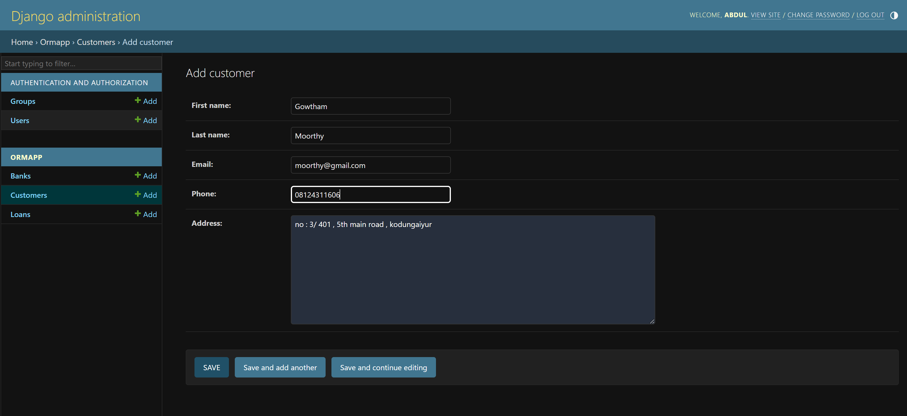
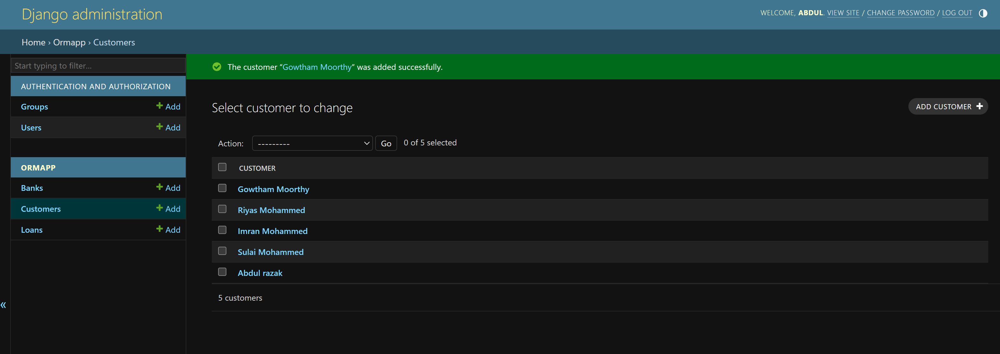
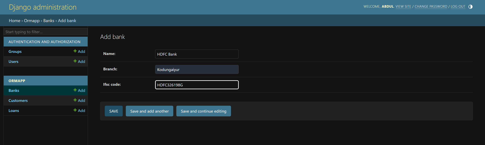
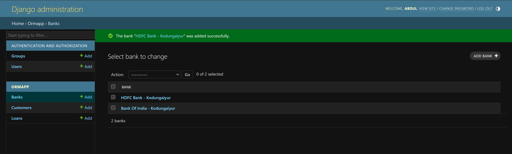
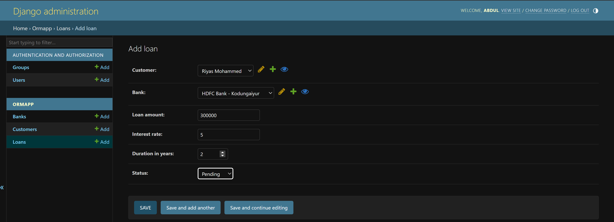
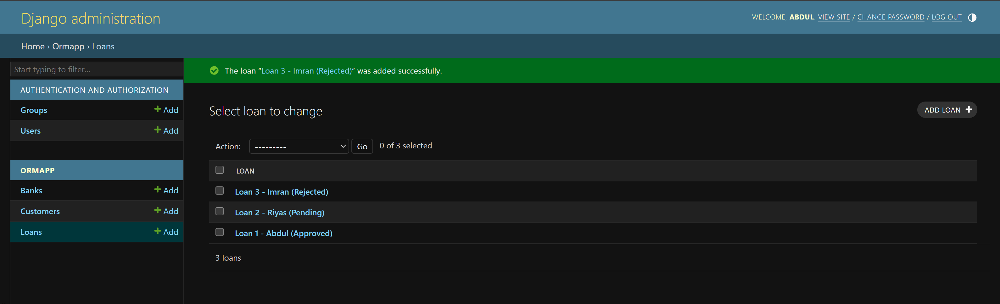

# Ex02 Django ORM Web Application
# Date: 5 / 10 / 2024
# AIM
To develop a Django application to store and retrieve data from a bank loan database using Object Relational Mapping(ORM).

# ENTITY RELATIONSHIP DIAGRAM


## DESIGN STEPS
## STEP 1:
Clone the problem from GitHub

## STEP 2:
Create a new app in Django project

## STEP 3:
Enter the code for admin.py and models.py

## STEP 4:
Execute Django admin and create details for Customers and apply for loan 

# PROGRAM
### Models.py
```python
from django.db import models
from django.db import models

class Bank(models.Model):
    name = models.CharField(max_length=255)
    branch = models.CharField(max_length=255)
    ifsc_code = models.CharField(max_length=11, unique=True)

    def __str__(self):
        return f"{self.name} - {self.branch}"

class Customer(models.Model):
    first_name = models.CharField(max_length=50)
    last_name = models.CharField(max_length=50)
    email = models.EmailField(unique=True)
    phone = models.CharField(max_length=15, unique=True)
    address = models.TextField()

    def __str__(self):
        return f"{self.first_name} {self.last_name}"

class Loan(models.Model):
    LOAN_STATUS_CHOICES = [
        ('Pending', 'Pending'),
        ('Approved', 'Approved'),
        ('Rejected', 'Rejected'),
    ]

    loan_id = models.AutoField(primary_key=True)
    customer = models.ForeignKey(Customer, on_delete=models.CASCADE, related_name='loans')
    bank = models.ForeignKey(Bank, on_delete=models.CASCADE, related_name='loans')
    loan_amount = models.DecimalField(max_digits=10, decimal_places=2)
    interest_rate = models.DecimalField(max_digits=5, decimal_places=2)
    duration_in_years = models.PositiveIntegerField()
    status = models.CharField(max_length=10, choices=LOAN_STATUS_CHOICES, default='Pending')
    date_applied = models.DateField(auto_now_add=True)

    def __str__(self):
        return f"Loan {self.loan_id} - {self.customer.first_name} ({self.status})"

```
### admin.py
```python
from django.contrib import admin
from .models import Bank, Customer, Loan

class BankAdmin(admin.ModelAdmin):
    list_display = ('name', 'branch', 'ifsc_code')  
    search_fields = ('name', 'branch', 'ifsc_code')  
    list_filter = ('branch',)  
    
class CustomerAdmin(admin.ModelAdmin):
    list_display = ('first_name', 'last_name', 'email', 'phone')  
    search_fields = ('first_name', 'last_name', 'email', 'phone')  
    list_filter = ('first_name',)  
    
class LoanAdmin(admin.ModelAdmin):
    list_display = ('loan_id', 'customer', 'bank', 'loan_amount', 'status', 'date_applied')  
    search_fields = ('loan_id', 'customer__first_name', 'bank__name', 'status')  
    list_filter = ('status', 'bank', 'date_applied')  
    list_editable = ('status',)  
    
admin.site.register(Bank)
admin.site.register(Customer)
admin.site.register(Loan)

```
# OUTPUT
1. Add Customer 

2. Customer List 

3. Add Bank 

4. Bank List 

5. Apply Loan 

6. Loan List 

7. User List


# RESULT
Thus the program for creating a database using ORM hass been executed successfully
